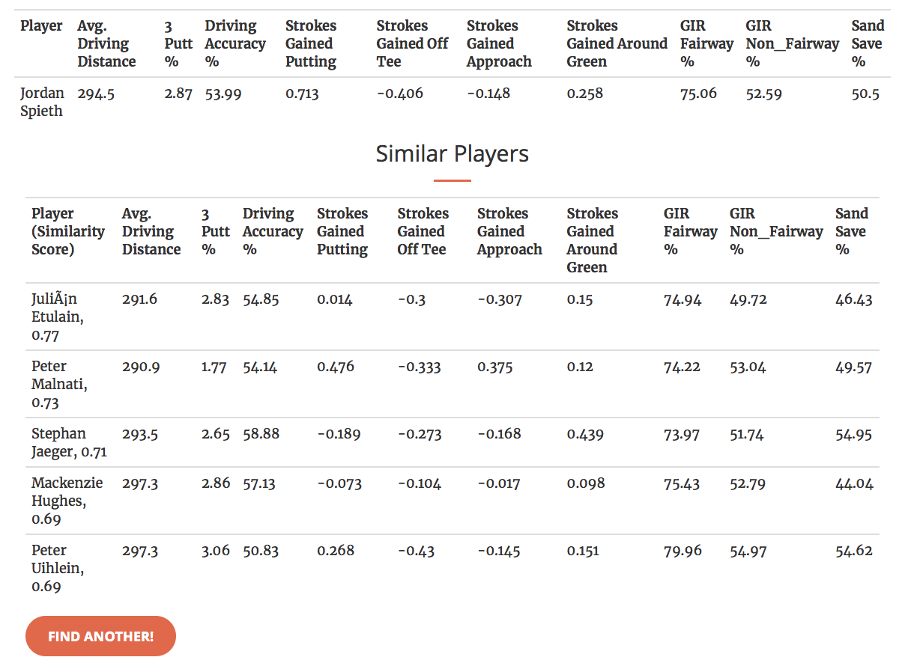

# PGA Tour Players: How Similar Are Their Statistics?

In professional golf there is a simple heuristic to categorize PGA Tour players based on their output: number of wins, cash earnings and world ranking standings. *“Rory McIlroy has 4 majors, Jordan Spieth has 3 majors, Brooks Koepka has 4 majors. They’re all in the same class.”*
I would argue that this doesn’t paint the full picture on how to measure similarities amongst golf players. We also want to understand the similarities based on player’s input: their actual performance across a variety of statistical categories.

*“Who has similar putting, driving, and ball-striking statistics to Jordan Spieth this season?”*

To answer this question, I gathered a bunch of PGA Tour data and built a little that finds similar players based on the major statistical categories amongst PGA Tour players for the 2019 season. 

Comments or Questions? Please email me at: perryrjohnson7@gmail.com
